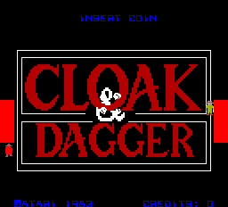
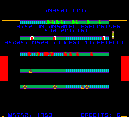
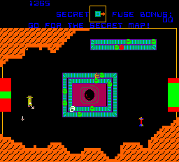
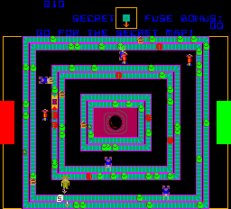

# Cloak & Dagger for Analogue Pocket

An openFPGA core for **Cloak & Dagger** (Atari, 1983), reimplemented in
gateware: a master 6502 at 1.0 MHz that runs the game, reads the inputs and
drives two POKEYs at 1.25 MHz into op-amp summing stages instead of a linear
mixer, and a slave 6502 at 1.25 MHz that does nothing but draw into a 256x256
bitmap through an auto-incrementing address generator at 0008-000f — eight
bus addresses that store or read a pixel and step a pointer, rather than a
RAM the CPU addresses directly. Agent X raids Dr. Boom's underground bomb
factory; you walk with one hand and fire with the other. There is no SDRAM in
the design: the whole machine, both 64 KB bitmap buffers included, is about
1.6 Mbit of block RAM, so every access is single-cycle and deterministic.
Nothing here is emulated in software.

> **ROMs are not included and never will be.** You supply your own MAME
> `cloak` romset; the core reads one image built from it.

**Status: builds clean and every simulation gate is green; not yet run on real
hardware.** Quartus 18.1 compiles it with 0 errors, fully constrained for
setup and hold, no negative slack in any of its 104 timing checks — 20% of the
ALMs, **50% of the block memory**, 12 DSP blocks. It has not been loaded onto a
Pocket. See "Open questions" for what that leaves unsettled.

|  |  |
|---|---|
|  |  |
|  |  |

All four are the core's own output: 256x232 frames captured from
`cloak_core` running in Verilator (`sim/run_system.sh`), not from MAME.

## Installing

1. Build the core (see "Building" below) or take a package from a CI run, and
   copy `Cores/`, `Platforms/` and `Assets/` onto the root of the Pocket's SD
   card.
2. Build the ROM image from your own MAME `cloak` romset and copy it to
   `Assets/cloak/common/cloak.rom`:

   ```sh
   python3 tools/mra_build.py cloak.mra cloak.zip
   ```

   The builder needs nothing but Python 3. It reads the MAME zip (or a
   directory of loose files) directly, checks every ROM's CRC32 against
   `cloak.mra`, and verifies the finished image against the md5 recorded
   there — so a wrong or damaged romset is reported rather than silently
   built into something that half works. An extracted romset directory works
   too, in place of the zip.

Settings and progress are saved to `cloak.sav` — the board's real 512-byte
NVRAM at 2800-29ff, not a scraped high-score table. Whatever the game itself
wrote is what round-trips, operator DIP-adjacent settings included.

## Controls

Cloak & Dagger is a twin-stick cabinet: the left stick walks Agent X around
and the right stick fires in eight directions, independently of movement.

| | |
|---|---|
| Walk | D-pad |
| Fire | X up, A right, B down, Y left — two at once for a diagonal |
| Fire (alt) | a dock controller's right analog stick, in the same eight directions |
| Igniter | either trigger (L or R) |
| Coin | Select |
| Start | Start |

The four face buttons stand in for the cabinet's right stick, in the diamond
they are physically arranged in — the mapping every twin-stick game gets on a
gamepad, and the reason this game needs all four rather than the usual one.
The igniter (the cabinet's own dedicated button, which lights the fuse) is on
both triggers so whichever hand is free can reach it.

DIP-switch equivalents — Credits, Coin A, Coin B, Demo Freeze Mode — the
Self-Test switch, an Audio DC Blocker toggle, a Debug Overlay toggle and
Screen Shape are all in the Pocket's Interact menu.

## The screen

The board runs 256x232 visible at **61.04 Hz**, not MAME's round 60 — see
"Open questions" below. The Pocket emits that raster unrotated (the cabinet
is ROT0) and **Screen Shape** in the Interact menu switches live between two
presentations:

| | what you get |
|---|---|
| **Arcade 4:3** (default) | the cabinet's shape, black bars either side |
| Fill Screen | stretched to reach both edges |

## How it is verified

Seven gates, all against MAME 0.288 as the oracle, described in full in
[docs/verification.md](docs/verification.md):

| gate | what it proves | cost |
|---|---|---|
| `tools/regress_render.sh` | the reference renderer reproduces MAME's own snapshot, pixel for pixel, on every state in the corpus | ~20 s |
| `sim/run_video.sh` | `cloak_video` reproduces the reference renderer, pixel for pixel, on every state | ~3 s |
| `sim/run_selftest.sh` | the whole machine — both 6502s, the memory map, the communication RAM, the video — reproduces MAME frame for frame through the game's own power-on self-test | ~60 s |
| `sim/run_audio_unit.sh` | `cloak_audio`'s output level against MAME's own op-amp expression, plus the decimator and the DC blocker | ~4 s |
| `sim/run_audio.sh` | the whole machine's sound against a MAME recording of the same sequence | ~3 min |
| `sim/run_gameplay.sh` | both machines through the same coin and start, diffed frame by frame | ~3 min |
| `sim/lint.sh` / `sim/lint_platform.sh` | Verilator over the core, and over everything the Pocket builds | ~1 s |

All of them are green, and the video gates are at **zero differing pixels**, not
"close": the reference renderer is pixel-identical to MAME on all 20 corpus
states, `cloak_video` reproduces it at zero differing pixels, and the whole
machine matches MAME at zero differing pixels across eight frames of the
game's own power-on self-test — which checks its master RAM, master ROM
checksums, motion object RAM, EAROM, slave RAM, slave ROM and the
communication path between the two CPUs, and prints `EAROM PARITY ?? LOC
21-K` in both, because the NVRAM starts all zero (bad parity) exactly as
MAME's own default gives it.

Audio is derived rather than approximated: the op-amp summing stage
(`rtl/cloak_audio.sv`) collapses MAME's `OPAMP_LOW_PASS` resistor-network
model to a sum of four per-volume conductances, checked identical to MAME's
own expression on 2,000 random values. `sim/run_audio_unit.sh` then checks
the core's settled output against that expression directly and agrees to
**under three LSBs of 32,767** across four volume combinations, and
`sim/run_audio.sh` puts the whole machine against a MAME recording of the
same coin-and-start sequence: **peak +0.61 dB, RMS −0.40 dB**.

Two things in that last measurement are worth knowing. MAME's stream carries
the POKEY summing node's standing DC offset and the core's does not, because
removing it is the whole point of the DC blocker — compared with the offset
still in, the core measures a spurious 1.1 dB quiet. And per-band energy is
reported but deliberately *not* gated: sliding the window 0.2 s along MAME's
own recording moves its 500 Hz band by 14 dB, so on this material a band
difference under about 6 dB says nothing at all. Peak and RMS are stable
against that shift; the exact level check is the unit bench's.

To reproduce a gate from scratch:

```sh
tools/stage_romset.sh                # zip + CRC-verify a loose MAME romset as build/roms/cloak.zip
tools/make_corpus.sh                 # dump the 20-state frozen corpus from MAME via Lua
tools/regress_render.sh              # reference renderer vs MAME's snapshots
sim/run_video.sh                     # cloak_video vs the reference renderer
tools/capture_selftest.sh            # capture MAME's self-test frames
sim/run_selftest.sh                  # whole machine vs those frames
tools/capture_gameplay.sh            # capture MAME through a coin, a start and a game
sim/run_gameplay.sh                  # the core through the same, diffed frame by frame
sim/run_audio_unit.sh                # op-amp ladder / decimator / DC blocker vs the arithmetic
tools/capture_audio.sh               # record MAME's audio for the same coin/start sequence
sim/run_audio.sh                     # whole machine's audio vs that recording (peak and RMS)
sim/lint.sh                          # Verilator over the core alone
sim/lint_platform.sh                 # Verilator over apf_top down — the whole Pocket build, megafunctions stubbed
```

[docs/hardware.md](docs/hardware.md) is the hardware map this was all built
from: chips and clocks, video timing, both memory maps, the bitmap's
address-generator ports, and the input bit assignments — written from MAME
0.288's `atari/cloak.cpp` and the romset's own vertical timing PROM.
[METHODOLOGY.md](METHODOLOGY.md) is the method this core and its siblings
follow: MAME as the oracle, a reference renderer as the executable spec,
frozen-state benches as the regression gate.

## Open questions

From [docs/verification.md](docs/verification.md) section 5, in full:

* **Frame rate: 61.04 Hz, not MAME's 60.** The vertical timing PROM settles
  256 lines, 232 active, absolutely. The horizontal half is not in the
  romset and MAME does not model it at all (`set_refresh_hz(60)` and
  nothing else). The working model — a 5 MHz dot clock (the board's one
  10 MHz crystal / 2) and 320 dots per line — is used because 60.000 Hz is
  arithmetically impossible with a 5 MHz dot clock and 256 lines (it needs
  325.5 dots per line), and because 320 divides cleanly into both CPU
  dividers: 64 master cycles and 80 slave cycles per scanline. The
  measurable effect is that this core gives the master 16,384 cycles per
  frame against MAME's 16,666 — 1.7% fewer — visible as attract-mode
  animation running a hair ahead of MAME's. If a horizontal timing PROM or a
  schematic ever settles this, the only thing to change is `HTOTAL` in
  `rtl/cloak_pkg.sv`.
* **The master CPU clock.** MAME runs the master 6502 at 1.0 MHz and the
  slave at 1.25 MHz, flagging both `????` in its own source. Both POKEYs sit
  on the master's bus, and a POKEY's single clock pin is both its bus clock
  and its audio clock — so on the real board the master's phi2 and the
  1.25 MHz POKEY clock are very likely the same signal, which would make the
  master 1.25 MHz too. The core follows MAME until this is settled, because
  MAME is what every gate diffs against; changing it is one constant in
  `rtl/cloak_core.sv`.
* **Things MAME does not model, and neither does this core**: the NVRAM
  write-enable bit at 3e00 (MAME latches it and never uses it); the "custom
  write" registers at master 2600 and slave 1400, which the driver's own
  comment says have something to do with positioning the display; and the
  watchdog kick at 3a00, decoded and discarded.
* **The bitmap clear.** A 65,536-pixel clear cannot be instantaneous on
  hardware, and MAME's is a `memset`. Measured in MAME, clears are rare
  (0.12 per frame) but 35 of 36 are immediately followed by the slave
  drawing into that buffer in the same frame, so the clear has to finish
  before the slave gets going. The core sweeps the buffer at the system
  clock and holds the slave's clock enable for the duration — about 1.6 ms,
  atomic.
* **Past about twenty seconds, the core and MAME stop being the same game.**
  The master reads POKEY's RANDOM register in 36 places and RANDOM is a
  free-running LFSR, which this core clocks 20,480 times per frame against
  MAME's 20,833 — a consequence of running the board's 61.04 Hz rather than
  MAME's round 60. Every read returns a different number, so the playthroughs
  diverge: different enemy placement, the level-entry screen showing the exit
  on the other side of the room. Both are correct; they are not identical.
  Through the first 21 seconds, before the RNG reaches anything visible,
  34 of 43 frames are pixel-identical and the rest differ only in animation
  phase.
* **The audio has been checked against MAME, not against a board.** MAME is
  a model of the hardware, and its own comment says the RC network it puts
  after the POKEYs is an approximation of what the board does next. Nothing
  here has been listened to on real hardware.

## Repository layout

| Path | What |
|---|---|
| `docs/hardware.md` | the machine, from MAME's driver and the romset's own PROM — read first |
| `docs/verification.md` | what is checked, how, and what is still open |
| `METHODOLOGY.md` | the method this core and its siblings follow |
| `rtl/` | the core: `cloak_core.sv` (clocking and top level), `cloak_main.sv` / `cloak_slave.sv` (the two 6502 buses), `cloak_video.sv` (playfield, bitmap, motion objects, palette), `cloak_audio.sv` (the op-amp output stage), `pokey.sv`, `dbg_overlay.sv` |
| `modules/` | the vendored T65 6502, see `modules/VENDOR.md` |
| `target/pocket/core_top.sv` | Pocket integration: the 40 MHz PLL, pixel-sync, control mapping, the save slot |
| `platform/pocket/` | the OpenGateware Pocket framework (APF bridge, scaler, audio path, Interact decoding) |
| `sim/` | Verilator benches: `run_video.sh`, `run_selftest.sh`, `run_system.sh`, `run_audio.sh`, `run_audio_unit.sh`, `lint.sh`, `lint_platform.sh` |
| `tools/` | `mra_build.py` (ROM image), `render_model.py` (reference renderer), `dump_state.lua` / `make_corpus.sh` (MAME capture), `capture_selftest.sh`, `capture_audio.sh`, `capture_title.sh` / `make_images.py` (Pocket artwork from the game's own raster) |
| `cloak.mra` | the ROM recipe, the standard MRA format |
| `ref/mame/` | the MAME sources this core was written from |
| `pkg/pocket/`, `projects/`, `package-pocket.py` | the SD-card package contents, Quartus project, and packaging script |
| `artifacts/` | scratch outputs (MAME snapshots, state dumps, diffs); gitignored |

## Building

```sh
./build-local.sh map        # analysis & synthesis only, catches most mistakes
./build-local.sh            # full compile in Docker (raetro/quartus:pocket), then package into release/pocket/
```

Needs Docker and the `raetro/quartus:pocket` image (Quartus 18.1).
`.github/workflows/compile.yml` lints with Verilator, compiles the same way
in CI on every push, checks that the block RAM budget and timing both hold,
and packages the result; a `v*` tag publishes it as a release.

## Credits and licences

The Cloak & Dagger-specific RTL, reference renderer and verification harness
(`rtl/`, `tools/`, `sim/`) are original; the rest of the core is built on
other people's work.

* MAME's `atari/cloak.cpp`, by **Dan Boris** and **Mirko Buffoni** — the
  driver `docs/hardware.md`, the reference renderer and the RTL were all
  written from: the memory maps, the IRQ scheme, the bitmap's
  address-generator semantics, and the vertical timing PROM's meaning.
* MAME's `sound/pokey.cpp`, by **Brad Oliver**, **Eric Smith** and **Juergen
  Buchmueller** (building on Ron Fries' original Pokey emulator) — `rtl/pokey.sv`
  and the op-amp collapse in `rtl/cloak_audio.sv` were written from its
  clock-by-clock order of operations and its `OPAMP_LOW_PASS` output model.
* MAME's `resnet.cpp`, by **Couriersud** — `compute_resistor_weights`, the
  source of the eight non-linear colour-gun levels the reference renderer
  reproduces.
* **T65**, the 6502 core from FPGAARCADE (Daniel Wallner, Mike Johnson,
  Wolfgang Scherr and other contributors) — `modules/cpu-t65`, used
  unmodified for both 6502s, GHDL-converted to Verilog by
  `tools/gen_vhdl_cores.sh` for synthesis and simulation alike, so what the
  benches verify is what ships.
* **OpenGateware / Raetro — Marcus Andrade** — `platform/pocket/` is his
  Pocket integration framework: the APF bridge, ROM/data loader, video
  scaler, audio path and filters, Interact option decoding, and the
  `raetro/quartus:pocket` Docker image CI and `build-local.sh` both compile
  in. Also in that layer: **Alexey Melnikov (Sorgelig)** — audio filters, DC
  blocker, scanlines and shadow mask; **Adam Gastineau** — data loader and
  unloader; **Jim Gregory** and **Alan Steremberg** — MAME hiscore/NVRAM
  support; **Till Harbaum** — the original scanline generator; **Analogue**
  — the openFPGA APF reference `core_top`.
* **MAME** as the oracle throughout — driven headless via the Lua scripts in
  `tools/` to dump frozen states, capture the self-test and the title
  screen, and record audio.

This core is licensed **GPLv3** (see `LICENSE`).

Cloak & Dagger is © 1983 Atari. No ROM data of any kind is included in this
repository — see "Installing" above.
